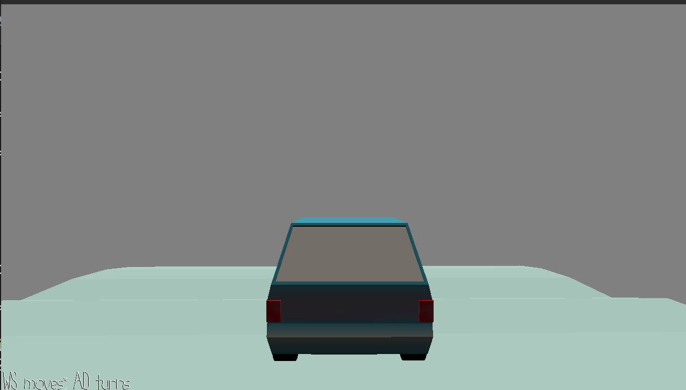

# Drive on Ice Simulator

Author: Yuan Meng

Design: Don't have much time to make this game because of mid-term. The idea is just to test how to put mix the normal way of moving and walkmesh. When you are at the edge of the walkmesh you just exit walkmesh mode. It's very hard to figure out how to steer a car so that part is basically shit. Also it's hard to get the friction force right so this is a driving on ice simulator. Also the model sometimes will go through the walkmesh, when on slopes, making it smoother can fix this(or make the car smaller)

Screen Shot:

How To Play:

WS is accelerate and brake. AD to turn. Want to get to the final destination.

Sources: The simple car model is from a free online website. But I downloaded it last semester and I could not find the original URL.

This game was built with [NEST](NEST.md).

